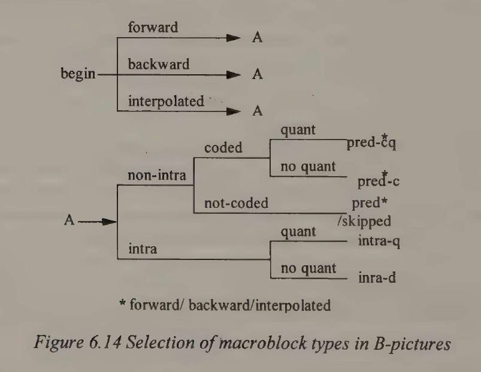
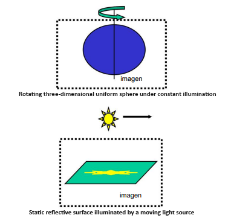

  
<h3>Advanced Media Framework (AMF)</h3>
  </a>
  

    Join/follow us on <a href="https://dsc.gg/matishzz-tweak" target="_blank">Discord</a> | <a href="https://x.com/Matishzz" target="_blank">𝕏 (Twitter)</a>
  

  

    <a href="https://github.com/Matishzz/OBS-Studio/blob/main/Installation%20manual.md">Installation Manual</a> ⠂<a href="https://github.com/Matishzz/OBS-Studio/blob/main/Troubleshooting.md">Troubleshooting</a> ⠂<a href="https://github.com/Matishzz/OBS-Studio">Automatic installation</a>
  

---
  

 
The following is a theoretical bank for the parameters available to alter the encoder commands, for no particular purpose but only for theoretical purposes, no preset configurations will be presented since you must adjust the parameters yourself depending on your relative need, even you will have problems after adjusting parameters that others may work normally and you must be sufficiently prepared and have been sufficiently cautious when adding the parameters to determine what you can do at that time.

 

 

 One of the most relevant moments when applying a parameter is to observe if it is able to satisfy the need of why we apply such parameter.

After having carefully read the parameters and applied the one that best fit our need, we have to observe the impact that it made on our video, for this we will use some tools like these 

<ul>
<li><a href="https://mediaarea.net/en/MediaInfo">MediaInfo</a>: You can quickly and easily observe the metadata such as codec, bitrate, resolution and others being also very easy to install and read</li>

<li><a href="https://github.com/fifonik/FFBitrateViewer">FFBitrateViewer</a>: Specifically to analyze the bitrate variation over time, useful to observe the compression efficiency and quality</li>

<li><a href="http://virtualdub2.com/">VirtualDub2</a>: Is an improved version of the normal VirtualDub (since the first version does not allow to import mp4) is useful to analyze frame by frame or jump to a specific frame</li>

<li><a href="https://mediaarea.net/QCTools">QCtools</a>: Provides visualizations of metrics such as color fluctuations, noise and compression artifacts, bitrate and many others</li>

<li><a href="https://www.elecard.com/products/video-analysis/streameye">StreamEye</a>: The best video analysis software, unfortunately it is a paid program and the demo version only lasts 30 days and shows us only 84 frames but thanks to it we can observe parameters such as GOP, motion prediction among a lot of complex metrics more</li>

<li><a href="https://github.com/fifonik/FFMetrics">FFMetrics</a>: Great tool that gives you the possibility to analyze PSNR, SSIM and VMAF metrics that are very important to evaluate the degradation in a decoding </li>
</ul>

 

B-Frame 🔋
----
In video compression a sequence of images is divided into different types according to their function in the prediction of future frames I-picture (intra-d + intra-q), P-picture, B-picture, D-picture

The <b>I-pictures</b> or also called intra images, are frames that are encoded without reference to any other, i.e. contain all the necessary information to be reconstructed without resorting to previous or future images, within this the macro blocks that are those compression units within the image, can be encoded in two ways <code>intra-d</code> or <code>intra-q</code> the difference lies in the quantization scale used in the case of <code>intra-d</code> the same previously established is maintained while in the <code>intra-q</code> a new quantization value is defined.

<b>P-pictures</b> introduce the concept of temporal prediction using information from previous frames to improve compression, instead of storing all the image information as in I-pictures, P-pictures contain only the changes with respect to a previous reference frame, This is achieved by analyzing the macro blocks of the current image and compares them with those of the reference image to determine whether or not they can be represented by a displaced version of a previous macro block, storing only the motion vector (which indicates the displacement necessary to reconstruct the macro block from the reference image) 

And what we are going to introduce is the <b>B-frames</b>, which take the temporal prediction to a higher level because they use information from both past frames and future frames, this bidirectional method allows an interpolation between the two to improve the quality of the prediction but it is much more expensive because the encoder must evaluate multiple options for each macro block determining whether to predict it by means of the after image, This is done by calculating the prediction error for each of these modes and choosing the one that minimizes the difference between the predicted and the actual macro block, a key point to clarify is that B-frames are not used as a reference for other frames, which means that it can be compressed more aggressively without affecting the quality of the sequence

The following is a flowchart of the decision process of the coding of each macro block in a <b>B-frame</b>, first the block can be predicted from a <b>forward</b> frame (previous), a future frame (<b>backward</b>) or a combination of both (<b>interpolated</b>), then it is classified as <code>intra</code> if it was not coded with reference to other frames or it is classified as <code>non-intra</code> if it uses a temporal prediction, in this case it must be decided what to do, because if it is not coded it will be skipped because its prediction is enough, if it is coded it must be decided if quantization is applied and if there is quantization it will be marked with a <code>pred-q</code> otherwise it will be marked with a <code>pred-c</code>.

Then there are the <b>D-pictures</b> which are frames that contain low frequency information, they only store the DC coefficients of the image blocks without including the details, their purpose is a fast navigation within the sequence, providing a simplified view of the content without the need to decode complete frames.

<table>
  <tr>
    <th>Integer parameter</th>
    <th>Defined</th>
    <th>Options</th>
    <th>Default</th>
    <th>Explanation</th>
    <th>Support</th>
  </tr>
  <tr>
    <td>VIDEO_ENCODER_MAX_CONSECUTIVE_BPICTURES</td>
    <td>MaxConsecutiveBPicture</td>
    <td>0-3</td>
    <td>3</td>
    <td>Maximum number of consecutive B Pictures ¹</td>
    <td>RDNA2³</td>
  </tr>
  <tr>
    <td>VIDEO_ENCODER_B_PIC_PATTERN</td>
    <td>BPicturesPattern</td>
    <td>0-3</td>
    <td>0</td>
    <td>Specifies how many b-frames to use between i-frames in a GOP ²</td>
    <td>RDNA2³</td>
  </tr>
  <tr>
    <td>VIDEO_ENCODER_ADAPTIVE_MINIGOP</td>
    <td>AdaptiveMiniGOP</td>
    <td>True/False</td>
    <td>False</td>
    <td>Variable number of B-frames between P-frames (Recommended with Pre-Analysis)</td>
    <td>RDNA2³</td>
  </tr>
  <tr>
    <td>VIDEO_ENCODER_B_REFERENCE_ENABLE</td>
    <td>BReferenceEnable</td>
    <td>True/False</td>
    <td>True</td>
    <td>Enable Refrence to B-frames</td>
    <td>RDNA2³</td>
  </tr>
</table>

 ¹ It is recommended to set the value to 3 (if <code>BPicturesPattern</code> is not 0), enable <code>AdaptiveMiniGOP</code> and <code>EnablePreAnalysis</code> 

 ² You may use a lower <code>PALookAheadBufferDepth</code> value proportionally with respect to the B-frame increase, for example setting <code>PALookAheadBufferDepth</code> to a value higher than 11 with 3 B-frames will cause a huge overhead to the encoder 

 ³ At a minimum you must have driver version <a href="https://www.amd.com/en/resources/support-articles/release-notes/RN-RAD-WIN-22-3-1.html">22.3.1</a> or later to be able to use B-frames without problems

Pre-Analysis 📝
----
Pre-analysis is a major component that operates in the pre-encoding phase of multimedia data, evaluating the activity of the content in individual blocks throughout each frame, as well as identifying video properties such as scene changes and static scenes, This detection capability is key to save on encoding because when identifying static scenes it will insert a skip frame reducing the number of frames to encode without being perceptible, it also applies adaptive content quantization (CAQ) to dynamically adjust according to the complexity of the content.

Improved management of I-Frames, usually inserted at fixed intervals or abrupt changes but with PA as it improves the detection of scene changes it improves the insertion for when you really need it.

 

<table>
  <tr>
    <th>Integer parameter</th>
    <th>Defined</th>
    <th>Options</th>
    <th>Default</th>
    <th>Explanation</th>
  </tr>
  <tr>
    <td>VIDEO_ENCODER_PRE_ANALYSIS_ENABLE</td>
    <td>EnablePreAnalysis</td>
    <td>True/False</td>
    <td>False</td>
    <td>Enable or disable Pre-Analysis ¹</td>
  </tr>
  <tr>
    <td>PA_SCENE_CHANGE_DETECTION_ENABLE</td>
    <td>PASceneChangeDetectionEnable</td>
    <td>True/False</td>
    <td>True</td>
    <td>Enable Scene Change Detection GPU algorithm ²</td>
  </tr>
  <tr>
    <td>PA_FRAME_SAD_ENABLE</td>
    <td>PAFrameSadEnable</td>
    <td>True/False</td>
    <td>True</td>
    <td>Enable <a href="https://arxiv.org/ftp/arxiv/papers/1803/1803.04607.pdf">Frame SAD algorithm</a></td>
  </tr>
  <tr>
    <td>PA_LOOKAHEAD_BUFFER_DEPTH</td>
    <td>PALookAheadBufferDepth</td>
    <td>0-41</td>
    <td>0</td>
    <td>The deeper the lookahead buffer size, the better the encoding quality and the higher the latency, I recommend the following sizes: <b>11</b> (short), <b>21</b> (medium) and <b>41</b> (long).<b>⁴</b></td>
  </tr>
  <tr>
    <td>PA_PAQ_MODE</td>
    <td>PAPerceptualAQMode</td>
    <td>0-1</td>
    <td>0</td>
    <td>Perceptual AQ mode <b>⁵</b></td>
  </tr>
  <tr>
    <td>PA_TAQ_MODE</td>
    <td>PATemporalAQMode</td>
    <td>0-2</td>
    <td>0</td>
    <td>It is a temporal adaptive quantization mode, it is recommended to use 2 in case of games and 1 in non-game applications <b>⁴</b> <b>⁵</b></td>
  </tr>
  <tr>
    <td>PA_HIGH_MOTION_QUALITY_BOOST_MODE</td>
    <td>PAHighMotionQualityBoostMode</td>
    <td>0-1</td>
    <td>0</td>
    <td>Parameter in the video encoding that adjusts the level of detail in high-motion scenes to improve visual quality <b>³ ⁶</b> </td>
  </tr>
  <tr>
    <td>PA_CAQ_STRENGTH</td>
    <td>PACAQStrength</td>
    <td>0-2</td>
    <td>1</td>
    <td>This will determine the adaptive content quantization (CAQ) intensity where 0 is low, 1 is medium and 2 is high, visual quality will be compromised in areas of fine detail when this intensity is higher</td>
  </tr>
  <tr>
    <td>PA_LTR_ENABLE</td>
    <td>PALongTermReferenceEnable</td>
    <td>True/False</td>
    <td>False</td>
    <td>Enable long-term reference frame management during pre-analysis (<a href="https://i.imgur.com/4izjPb1.png">4izjPb1.png</a>)</td>
  </tr>
</table>

 ¹ If you decide to use pseudo 2-pass <code>EnableVBAQ</code> will be automatically disabled, also note that this is affected by the codec name e.g. <code>EnablePreAnalysis</code> for H.264, <code>HevcEnablePreAnalysis</code> for H.265 and <code>Av1EnablePreAnalysis</code> for AV1 

 ² This parameter must be set to false if you are using HQCBR 

 ³ It turns out that for some reason in drivers prior to 24.1.1 PAHMQB will not work if PALookAheadBufferDepth is not configured, but in later drivers it will enable it even if it is not configured (do not use 24.2.1 as some users report problems), also note that if you have a graphics card lower than the 7000 series and use PAHMQB together with PA_TAQ_MODE you could experience serious problems.

 ⁴ This parameter is required for TAQ to work but is not required for PAQ

 ⁵ You can only use either <code>PA_TAQ_MODE</code> or <code>PA_PAQ_MODE</code>

Rate Control 🎭
----
<table>
  <tr>
    <th>Integer parameter</th>
    <th>Defined</th>
    <th>Options</th>
    <th>Default</th>
    <th>Explanation</th>
  </tr>
  <tr>
    <td>VIDEO_ENCODER_PREENCODE_ENABLE</td>
    <td>RateControlPreanalysisEnable</td>
    <td>0-1</td>
    <td>1</td>
    <td>Enables pre-encode assisted rate control</td>
  </tr>
  <tr>
    <td>VIDEO_ENCODER_ENFORCE_HRD</td>
    <td>EnforceHRD</td>
    <td>True/False</td>
    <td>True</td>
    <td>Force the use of a hypothetical reference decoder that is used to verify that the output bitstream is correct (see <a href="https://iphome.hhi.de/schierl/assets/improved-decoder-HEVC.pdf">HRD Paper</a> for more information) <b>¹</b></td>
  </tr>
  <tr>
    <td>VIDEO_ENCODER_FILLER_DATA_ENABLE</td>
    <td>FillerDataEnable</td>
    <td>True/False</td>
    <td>False (True in CBR)</td>
    <td>Enables or disables Filler data is usually useful for CBR <b>¹</b></td>
  </tr>
  <tr>
    <td>VIDEO_ENCODER_VBV_BUFFER_SIZE</td>
    <td>VBVBufferSize</td>
    <td>10.000 - 100.000.000</td>
    <td></td>
    <td>VBV Buffer Size in bits</td>
  </tr>
  <tr>
    <td>VIDEO_ENCODER_INITIAL_VBV_BUFFER_FULLNES</td>
    <td>InitialVBVBufferFullness</td>
    <td>0-64</td>
    <td>64</td>
    <td>Determines the initial filling level of the VBV buffer, working with percentages where 0 is 0% and 64 is 100%</td>
  </tr>
  <tr>
    <td>VIDEO_ENCODER_PEAK_BITRATE</td>
    <td>PeakBitrate</td>
    <td>10.000 - 100.000.000</td>
    <td></td>
    <td>Peak bit rate in bits</td>
  </tr>
  <tr>
    <td>VIDEO_ENCODER_MIN_QP</td>
    <td>MinQP</td>
    <td>0-51</td>
    <td>0</td>
    <td>Sets the minimum Quantization Parameter (QP). The lower the QP, the lower the compression (higher bit rate requirements) and the less compression artifacts (higher quality)</td>
  </tr>
  <tr>
    <td>VIDEO_ENCODER_MAX_QP</td>
    <td>MaxQP</td>
    <td>0-51</td>
    <td>51</td>
    <td>Sets the maximum Quantization Parameter (QP). The lower the QP, the lower the compression (higher bit rate requirements) and the less compression artifacts (higher quality).</td>
  </tr>
</table>

 ¹ <code>FillerDataEnable</code> is intrinsically linked to <code>EnforceHRD</code>, as without <code>EnforceHRD</code> the encoder will have no need to insert filler data to maintain a constant bitrate, note that it only works with CBR 

 

Psy 🍯
---
<table>
  <tr>
    <th>Integer parameter</th>
    <th>Defined</th>
    <th>Options</th>
    <th>Default</th>
    <th>Explanation</th>
    <th>Support</th>
  </tr>
  <tr>
    <td>VIDEO_ENCODER_DE_BLOCKING_FILTER</td>
    <td>DeBlockingFilter</td>
    <td>True/False</td>
    <td>True</td>
    <td>De-blocking Filter</td>
    <td>H.264</td>
  </tr>
  <tr>
    <td>VIDEO_ENCODER_ENABLE_VBAQ</td>
    <td>EnableVBAQ</td>
    <td>True/False</td>
    <td>True (False in CQP)</td>
    <td>This will cause more bits to be assigned to the smooth areas to improve compression quality ¹</td>
    <td>H.264</td>
  </tr>
  <tr>
    <td>VIDEO_ENCODER_HIGH_MOTION_QUALITY_BOOST_ENABLE</td>
    <td>HighMotionQualityBoostEnable</td>
    <td>True/False</td>
    <td>False</td>
    <td></td>
  </tr>
</table>

 ¹ When used with CQP it will be completely deactivated 

Motion Estimation 📈
---

Motion Estimation is a fundamental process in this field, involving the estimation and modeling of object movements in a sequence of images. At a basic level, it refers to the technique used to determine how objects in a scene move over time in a video. 

In the three-dimensional environment, motion is a clearly defined physical property, but when an image is captured, a two-dimensional representation of the three-dimensional scene is projected. Therefore, motion in an image sequence is essentially the result of projecting the displacements of objects in the three-dimensional scene onto the two-dimensional image plane. The concept of motion can be divided into two main aspects: the 2D motion vector field and the optical flow. The 2D motion vector field represents the projection of the three-dimensional motion of objects on the image plane, while the optical flow captures the appearance of motion as a function of the spatio-temporal variations of pixel intensities. Although these two concepts often coincide, they are not required to do so.

* In the first example, we have a three-dimensional uniform sphere rotating under constant illumination. In this case, the 2D motion vector field is non-zero, since the sphere is moving in three-dimensional space. However, this motion does not lead to a time-varying brightness pattern, so the optical flow is zero.

* In the second example, we represent a static reflective surface illuminated by a moving light source. Here, the 2D motion vector field is zero, since the surface is not moving in 3D space. However, the optical flow is non-zero, since the change in the position of the light source creates variations in pixel intensities over time.

Compression efficiency is achieved by exploiting data redundancies in both spatial and temporal dimensions. Spatial redundancies are greatly reduced by transform coding, such as the use of the Discrete Cosine Transform (DCT) or Discrete Wavelet Transform (DWT), while temporal redundancies are reduced by predictive coding. Motion-based prediction is used to maximize temporal correlation along motion trajectories, which in turn contributes to compression efficiency.

 

<table>
  <tr>
    <th>Integer parameter</th>
    <th>Defined</th>
    <th>Options</th>
    <th>Default</th>
    <th>Explanation</th>
  </tr>
  <tr>
    <td>VIDEO_ENCODER_MOTION_HALF_PIXEL</td>
    <td>HalfPixel</td>
    <td>True/False</td>
    <td>True</td>
    <td>It is a method which involves dividing each pixel in the image into two sub-pixels (allows for more accurate motion estimation)</td>
  </tr>
  <tr>
    <td>VIDEO_ENCODER_MOTION_QUARTERPIXEL</td>
    <td>QuarterPixel</td>
    <td>True/False</td>
    <td>True</td>
    <td>It is a method that consists of dividing each pixel of the image into four sub-pixels (allows an even more accurate estimation of movement)</td>
  </tr>
</table>

Sources consulted for the realization of this theoretical framework 📚
---

 Some of the sources were not read in their entirety but extracted some fragments, or used some images 

<li><a href="https://github.com/obsproject/obs-studio/wiki/AMF-Options">obs-studio/wiki/AMF-Options</a></li>
<li><a href="https://github.com/GPUOpen-LibrariesAndSDKs/AMF/blob/master/amf/doc/AMF_Video_Encode_HEVC_API.pdf">amf/doc/AMF_Video_Encode_HEVC_API.pdf</a></li>
<li><a href="https://github.com/GPUOpen-LibrariesAndSDKs/AMF/blob/master/amf/doc/AMF_Video_PreProcessing_API.pdf">amf/doc/AMF_Video_PreProcessing_API.pdf</a></li>
<li><a href="https://github.com/GPUOpen-LibrariesAndSDKs/AMF/blob/master/amf/doc/AMF_Video_PreAnalysis_API.pdf">amf/doc/AMF_Video_PreAnalysis_API.pdf</a></li>
<li><a href="https://github.com/GPUOpen-LibrariesAndSDKs/AMF/blob/master/amf/doc/AMF_Video_Decode_API.pdf">amf/doc/AMF_Video_Decode_API.pdf</a></li>
<li><a href="https://github.com/GPUOpen-LibrariesAndSDKs/AMF/blob/e1acd43bb000f7e0c3a2bd022a145aa931169bc6/amf/public/include/components/VideoEncoderVCE.h">amf/public/include/components/VideoEncoderVCE.h</a></li>
<li><a href="https://github.com/GPUOpen-LibrariesAndSDKs/AMF/issues">amf/issues</a></li>
<li><a href="https://codecalamity.com/amd-improves-video-encoding-yet-again-this-time-with-pre-analysis/">AMD improves video encoding yet again! This time with Pre-Analysis</a></li>
<li><a href="https://codecalamity.com/amd-re-introduces-the-b-frame/">AMD Re-introduces the B-frame!</a></li>
<li><a href="https://cagnazzo.wp.imt.fr/files/2018/03/poly_me.pdf">Motion Estimation Techniques</a></li>
<li><a href="https://arxiv.org/ftp/arxiv/papers/1803/1803.04607.pdf">A Perceptual Based Motion Compensation Technique for Video Coding</a></li>
<li><a href="https://es.wikipedia.org/wiki/Tipos_de_frames_(compresi%C3%B3n_de_video)#/media/Archivo:I_P_and_B_frames.svg">Media/Archivo:I_P_and_B_frames.svg</a></li>
<li><a href="https://www.researchgate.net/figure/Motion-Estimation-process_fig1_335633474">Figure/Motion-Estimation-process_fig1</a></li>
<li><a href="https://arxiv.org/ftp/arxiv/papers/1803/1803.04607.pdf">A Perceptual Based Motion Compensation Technique for Video Coding</a></li>
<li>Data Compression: The Complete Reference - David Salomon</li>
<li>Video coding an introduction to standard codecs - Mohammed Ghanbari</li>
