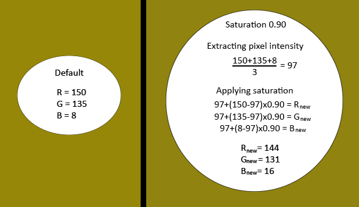

  

 # 
  You came too early, I haven't finished it yet 

---
 

# Table of Contents :books:
* Effect Filters
  * Color Correction
  * Chroma Key
 
* Audio Filters
   * Noise Gate
 
 # Color Correction 🥀
To understand this filter you must first understand how video capture works, when OBS captures a source, such as the game or the full screen, it obtains a sequence of images composed of pixels. Each pixel has three components red, green and blue, represented by numerical values usually 0 to 255 (if working in the RGB 8bit color space) these RGB channel values define the color and intensity of each pixel in the image, the value 0 represents the total absence of color while 255 indicates the maximum intensity of this color. When the scene is captured by OBS, the RGB values are stored in a matrix, where each element of the matrix represents a pixel and contains the values of its three channels, this pixel matrix is essentially a representation of the captured image OBS processes this matrix to display the image in real time or save it to a file.

Within this matrix each row represents a row of pixels in the image and each column represents a pixel in that row, if you have a 1920x1080 image you would have a matrix of 1920 rows and 1080 columns. Now going a little deeper into this filter added in 2015 when applying this filter some specific mathematical calculations are performed on the values of the RGB channels of each pixel, these usually use a multiplication to the values of these channels, an example of this operation is the one seen in this image
 
Considering this, the pixel (5,10) had a previous value of `R = 150` `G = 135` `B = 8`, after applying the saturation taking into account that the intensity of the pixel is `97` the values are now `R = 144` `G = 131` `B = 16`, if we have a resolution in the OBS of 1920x1080 where there are 207363600 pixels, this procedure is done in each of the pixels.

    
  
 ❗ <b>The values were rounded up as some of them gave too many decimals, this was done to make the demonstration more understandable, in the real process the numbers are not rounded.</b> ❗ 

# Chroma Key 🍀
The chroma key is a technique generally used in the film industry, television and other environments to create visual effects or virtual backgrounds, this technique is based on the idea that a specific color in an image is made "transparent", allowing the background behind that color to be visible, usually using the color green as this color tends to be more distinctive and is less likely to appear in the picture.

In this technique no very complex mathematical intervention is used but it is interesting to analyze it, each pixel of the image has values for the red, green and blue channels. The green channel is extracted from the image, for this a threshold is applied to detect the green values that correspond to the background. Values above a certain threshold are considered part of the green background, while values below the threshold are part of the subject. An inverse mask is also applied, where pixels belonging to the background have a value of 0 and pixels belonging to the subject have a value of 1, this serves to combine the subject and the background.
The OBS Studio section gives us 3 options in this filter, the options are as follows:
* <b>Similirarity (1-1000)</b>
  * This parameter controls how close the color of the selected background must be to the color of the pixel to be considered part of the background to be removed, i.e. a high value will make the filter stricter with colors slightly different from the background color.
* <b>Smoothness (1-1000)</b>
  * This serves to determine how gradual the transition is between the subject and the background removed if a very high value will make the transition smoother and less abrupt. 
* <b>Key Color Spill Reduction (1-1000)</b>
  * This is related to reflections or illumination, usually left at 100 (default).
 
 # Noise Gate 🚪
 This is an audio effect, in my OBS script I usually leave it default in very general values but configuring it is very interesting and can be improved a lot, its explanation is simple, its objective is to eliminate/reduce unwanted noise in the desired audio track, it acts as its name says as a door that opens or closes depending on such thresholds and times.

It is important to talk about its configurable parameters, OBS gives us the possibility to configure this opening and closing threshold together with some "timings", the explanation of each one is this:

* <b>Close Threshold</b>
  * This is the volume level below which the Noise Gate will close its gate and reduce the volume.
* <b>Open Threshold</b>
  * This threshold controls the point at which the Noise Gate will open its gate again, allowing the signal to flow, when the audio signal is higher than this dB the gate will open.
* <b>Attack Time</b>
  * This time expressed in "ms", determines how long it takes for the Noise Gate to close once the closing threshold is crossed.
* <b>Hold Time</b>
  * It is the time during which the door remains closed after the closing threshold has been crossed, this helps a lot with audio jitter (I won't talk about audio jitter here, but here is a [document](https://www.by-rutgers.nl/PDFiles/Audio%20Jitter.pdf) where this phenomenon is discussed in detail). 
* <b>Release Time</b>
  * When the door closes and the opening threshold is reached, the release time determines how long it takes for the door to fully open.
