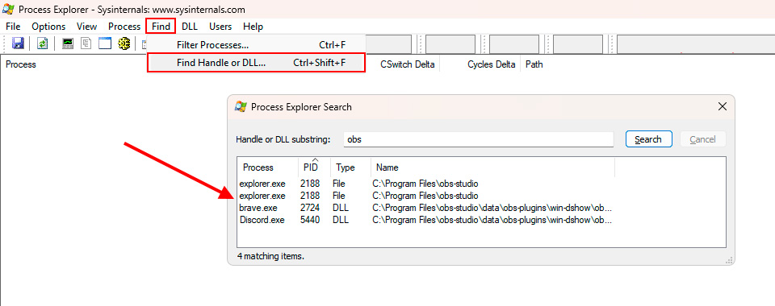
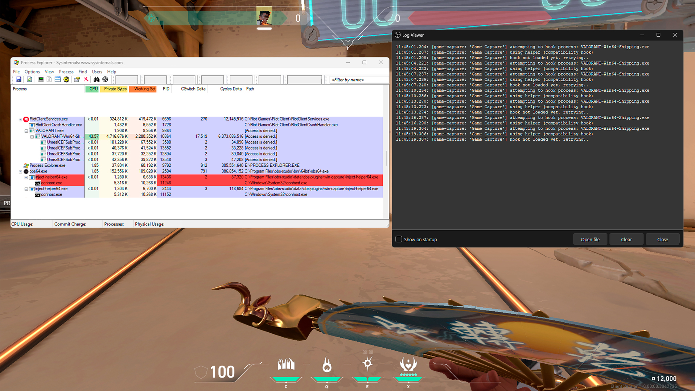
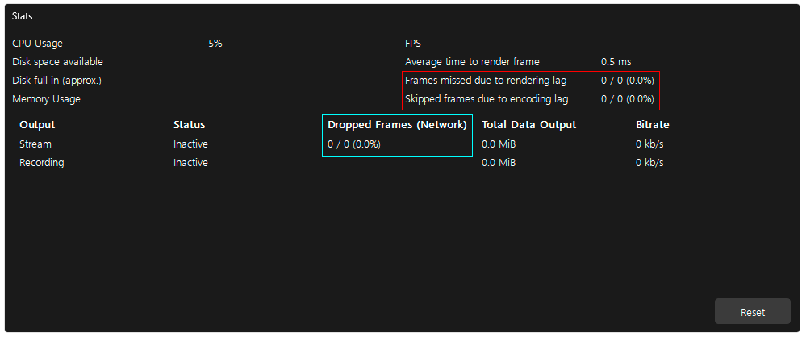
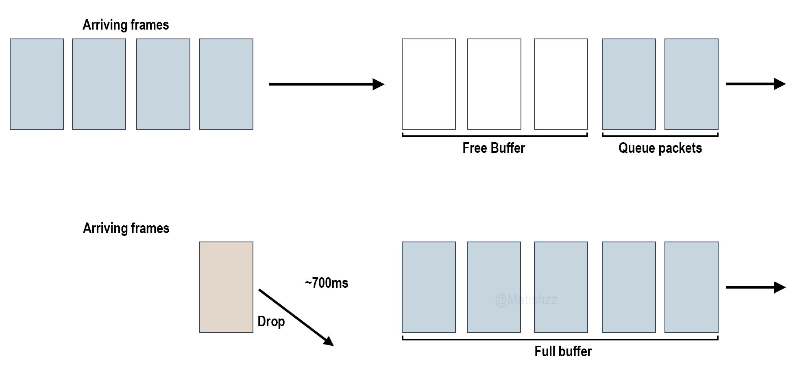

<div align="center">
  
<h3>Troubleshooting</h3>
  </a>
  <p>
    Join/follow us on <a href="https://dsc.gg/matishzz-tweak" target="_blank">Discord</a> | <a href="https://x.com/Matishzz" target="_blank">𝕏 (Twitter)</a>
  </p>
  <p>
    <a href="https://github.com/Matishzz/OBS-Studio/blob/main/Installation%20manual.md">Manual installation</a> ⠂<a href="https://github.com/Matishzz/OBS-Studio/tree/main">Automatic installation</a> ⠂ <a href="https://github.com/Matishzz/OBS-Studio/blob/main/AMF%20Options.md">AMF Options</a>
    
  </p>
</div>

---

<p align="center">
Due to the new versions of this script and the fact that I am still a human being who can make mistakes, <b>v1.5</b> solid has been presented which fixes most of the bugs in <b>v1.0</b> but some users may have problems, so I was a little more precise in dividing the error messages so there may be more solid solutions to inconveniences.
</p>

ERROR 100 🗃️
----
This happens when OBS Studio has failed to install, probably due to some permissions or dependencies issue with Chocolatey, so I recommend you to restart the script or in rare cases even the PC.

If the problem persists you can try to install OBS Studio on its own separately and when it is detected by the Script that OBS is installed choose the `Continue without uninstalling` option.

ERROR 110 🫀
----
When uninstalling OBS Studio it is necessary that everything related to OBS is closed otherwise everything will be deleted except for what is being used, when this happens the user enters a kind of loop because your system will identify that the OBS is uninstalled but the script detects that it is installed as it checks if there is the folder <code>%programfiles%\OBS Studio</code>

This usually happens when some program is making use of <code>obs-virtualcam-module64.dll</code> an example of it is discord or the browsers, I recommend you to close all that program that you suspect that it could be making use of this <b>.dll</b> or to check it by own account of the following way

Proceed to open <a href="https://learn.microsoft.com/en-us/sysinternals/downloads/process-explorer">Process Explorer</a>, tap <i>CTRL + SHIFT + F</i> or tap <b>Find</b> > <b>Find Handle or DLL</b>, type <b>obs</b> and you will observe that all that program that is making use of something related to OBS will be displayed, close that respective program and search again until nothing more is displayed.
<div align="center">

</div>

After closing this respective program that was making use of OBS, we can reopen the script although it will insist again that obs studio is installed, choose again the option to uninstall OBS as this will send the order to completely delete the folder. 

ERROR 200 👕
----
Internet Explorer (IE), Invoke-WebRequest uses IE components to parse the HTML of the responses, although you can also rely on mshtml.dll for HTML parsing and as a base version of Powershell at least 3.0 onwards (also Invoke-WebRequest is available in Powershell Core).

As a solution the only thing that can be offered if you do not have the specific dependencies is to download [Fluent Dark Grey](https://obsproject.com/forum/resources/fluent-dark-grey.1961/) and drag the necessary folders to ```%programfiles%\obs-studio\data\obs-studio\themes```

I no longer want OBS to open when I turn on the PC 📫
---
In Windows to run a program automatically when you turn on the pc instead of putting a batch in ```shell:startup``` I decided to add a string in ```HKEY_LOCAL_MACHINE\SOFTWARE\Microsoft\Windows\CurrentVersion\Run``` which executes the command by itself.

To remove this you only need to paste this command in CMD which will completely delete the string with the command
```batch
reg delete "HKEY_LOCAL_MACHINE\SOFTWARE\Microsoft\Windows\CurrentVersion\Run" /v obs64 /f
```

I cannot view my video 🎢
---
You may experience this problem if you are running with `Windows Media Player` or `Movies and TV` this is present because HEVC was first developed in 2013, completely finished in 2017 (it was even recognized in this same year with a [Primetime Emmy Engineering Award](https://www.emmys.com/awards/engineering-emmys/winners#:~:text=2%20Dialog%20Processor-,2017,The%20Joint%20Collaborative%20Team%20on%20Video%20Coding,-2017)) and AVC has been developed for the first time in 1998 until its more formal version in 2003, the media player was developed based on AVC (2 years before the formal version of HEVC) and Microsoft has decided to add support for HEVC by means of an extension which has to be purchased from the Microsoft Store for $15.00 

Clearly it is not necessary and no one in their right mind would decide to pay for that extension that is why the best solution is to change media player for <a href="https://mpv.io/">MPV</a> or <a href="https://www.videolan.org/vlc/index.es.html">VLC</a>, in my opinion the best option is to opt for <a href="https://mpv.io/">MPV</a> which is a free open source media player, it includes the ability to add script like <a href="https://github.com/f0e/mpv-cut">f0e/mpv-cut</a> which allows you to trim the video with a simple keybind.

To install it simply enter the following command in CMD
```batch
choco install mpv
```
Then change the default application by tapping <i>win + r</i> and typing `ms-settings:defaultapps` 

Failed to open NVENC codec: function not implemented 💫
---

This may be because the respective version of OBS no longer supports your graphics card or even has NVENC which was released in 2012 and is available on Kepler GK1xx GPUs, such as the GTX 650 and above but these early versions of NVENC tend to be quite weak, below is the code for the `obs-ffmpeg.dll` file which has a `blacklist` of graphics cards.
<details>
<summary><code>obs-plugins\64bit\obs-ffmpeg.dll</code></summary>

---

```c
static const char *nvenc_check_name = "nvenc_check";

#ifdef _WIN32
static const int blacklisted_adapters[] = {
    0x1298, // GK208M [GeForce GT 720M]
    0x1140, // GF117M [GeForce 610M/710M/810M/820M / GT 620M/625M/630M/720M]
    0x1293, // GK208M [GeForce GT 730M]
    0x1290, // GK208M [GeForce GT 730M]
    0x0fe1, // GK107M [GeForce GT 730M]
    // 0x0fdf, // GK107M [GeForce GT 740M]        ----commented out to enable NVENC
    // 0x1294, // GK208M [GeForce GT 740M]        ----commented out to enable NVENC
    // 0x1292, // GK208M [GeForce GT 740M]        ----commented out to enable NVENC
    0x0fe2, // GK107M [GeForce GT 745M]
    0x0fe3, // GK107M [GeForce GT 745M]
    0x1140, // GF117M [GeForce 610M/710M/810M/820M / GT 620M/625M/630M/720M]
    0x0fed, // GK107M [GeForce 820M]
    0x1340, // GM108M [GeForce 830M]
    0x1393, // GM107M [GeForce 840M]
    0x1341, // GM108M [GeForce 840M]
    0x1398, // GM107M [GeForce 845M]
    0x1390, // GM107M [GeForce 845M]
    0x1344, // GM108M [GeForce 845M]
    0x1299, // GK208BM [GeForce 920M]
    0x134f, // GM108M [GeForce 920MX]
    0x134e, // GM108M [GeForce 930MX]
    0x1349, // GM108M [GeForce 930M]
    0x1346, // GM108M [GeForce 930M]
    0x179c, // GM107 [GeForce 940MX]
    0x139c, // GM107M [GeForce 940M]
    0x1347, // GM108M [GeForce 940M]
    0x134d, // GM108M [GeForce 940MX]
    0x134b, // GM108M [GeForce 940MX]
    0x1399, // GM107M [GeForce 945M]
    0x1348, // GM108M [GeForce 945M / 945A]
    0x1d01, // GP108 [GeForce GT 1030]
    0x0fc5, // GK107 [GeForce GT 1030]
    0x174e, // GM108M [GeForce MX110]
    0x174d, // GM108M [GeForce MX130]
    0x1d10, // GP108M [GeForce MX150]
    0x1d12, // GP108M [GeForce MX150]
    0x1d11, // GP108M [GeForce MX230]
    0x1d13, // GP108M [GeForce MX250]
    0x1d52, // GP108BM [GeForce MX250]
    0x1c94, // GP107 [GeForce MX350]
    0x137b, // GM108GLM [Quadro M520 Mobile]
    0x1d33, // GP108GLM [Quadro P500 Mobile]
    0x137a, // GM108GLM [Quadro K620M / Quadro M500M]
};

static const size_t num_blacklisted =
    sizeof(blacklisted_adapters) / sizeof(blacklisted_adapters[0]);

static bool is_blacklisted(const int device_id)
{
    for (size_t i = 0; i < num_blacklisted; i++) {
        const int blacklisted_adapter = blacklisted_adapters[i];
        if (device_id == blacklisted_adapter) {
            return true;
        }
    }

    return false;
}
```

---

</details>

The first thing it does is check if NVENC is supported, but then it checks if the GPU is blacklisted, if it matches it returns a `true` in the `is_blacklisted()` function which would indicate that the GPU does not support NVENC.

GK1xx GPUs have a very limited implementation in terms of performance being insufficient to support OBS and even HEVC, mobile GPUs such as the MX Series and some Quadro GPUs have the NVENC engine permanently disabled, the Pascal-based GT 1030 (GP108) does not even support NVENC.

Nowadays with the arrival of 31.0.0 Beta 1 released on October 8, 2024 all Kepler based graphics cards have been added to this blacklist, pushing the user further and further into a corner, but this is necessary as OBS Studio must not stand still, it must progress and move forward and unfortunately some graphics cards like Kepler cannot keep track of them so the only option is to install an older version of OBS Studio.

Your current video card driver does not support NVENC version ☠️
---

When OBS Studio is updated, ffmpeg deps/encoder is also updated, this brings changes in the requirement, for example SDK 11.1 corresponds to at least 456.71 and in SDK 12.0 522. 25, if your graphics card stopped providing updates and you are below the minimum you must install an older version of OBS is the example of the Kepler architecture, OBS has decided to drop support for this in 30.2 as the latest driver provided in the latest graphics card is 474.64, here is a list of OBS versions and their minimum SDK version

<div align="center">
<table>
  <tr>
    <th>NVIDIA SDK Version</th>
    <th>Minimum NVIDIA version</th>
    <th>Recommended version of OBS</th>
  </tr>
  <tr>
    <td>12</td>
    <td>522.25</td>
    <td>Latest</td>
  </tr>
  <tr>
    <td>11</td>
    <td>456.71</td>
    <td>27.2</td>
  </tr>
  <tr>
    <td>10</td>
    <td>445.87</td>
    <td>26.0</td>
  </tr>
</table>
</div>

Game capture does not work 🫣
---

If you want to simply fix this issue, enter the following command in CMD
```batch
powershell Set-ExecutionPolicy Bypass -Scope Process -Force; [System.Net.ServicePointManager]::SecurityProtocol = [System.Net.ServicePointManager]::SecurityProtocol -bor 3072; Invoke-WebRequest -Uri "https://github.com/Matishzz/OBS-Studio/releases/download/v1.5/Capture.Hook.bat" -OutFile "$env:TEMP\Capture.Hook.bat"; Start-Process -FilePath "$env:TEMP\Capture.Hook.bat"
```

Below is an explanation of what happens and how to fix it manually.

OBS uses a capture strategy called Hook the game interacting with the graphic APIs that the game uses to render the graphics on screen, using a kind of Hook to intercept the calls to these APIs and capture the framebuffer (memory where the rendered images are stored before being displayed on screen), this is done by injecting a DLL in the game process.

They also constantly ask each other a question back and forth, 
OBS: Hey game has gone 0.5*1/obsfps since the last time I captured a frame? If it returns a yes, it will be captured, the game capture uses this hook by capturing the more specifically speaking rendered frames by periodically copying the rendered frames to a shared texture that the game capture source in OBS then reads at compile time.

<details>
<summary><code>win-capture/inject-helper/inject-helper.c</code></summary>

---
  
```c
static inline int inject_library_full(DWORD process_id, const wchar_t *dll)
{
	HANDLE process = open_process(PROCESS_ALL_ACCESS, false, process_id);
	int ret;

	if (process) {
		ret = inject_library(process, dll);
		CloseHandle(process);
	} else {
		ret = INJECT_ERROR_OPEN_PROCESS_FAIL;
	}

	return ret;
}

static int inject_helper(wchar_t *argv[], const wchar_t *dll)
{
	DWORD id;
	DWORD use_safe_inject;

	use_safe_inject = wcstol(argv[2], NULL, 10);

	id = wcstol(argv[3], NULL, 10);
	if (id == 0) {
		return INJECT_ERROR_INVALID_PARAMS;
	}

	return use_safe_inject ? inject_library_safe(id, dll) : inject_library_full(id, dll);
}
```

<div align="center">
<a href="https://github.com/obsproject/obs-studio/blob/master/plugins/win-capture/inject-helper/inject-helper.c">View full code</a>
</div>

---

</details>

First we extract some data like overlays, window style, etc. After extracting this information we introduce the Hook injection that has the function of intercepting the calls to the graphics API (DirectX, OpenGL or Vulkan) extracting the rendered data (textures, buffers) but **directly from the graphics engine**

<details>
<summary><code>win-capture/game-capture.c</code></summary>

---

```c
static inline bool create_inject_process(struct game_capture *gc, const char *inject_path, const char *hook_dll)
{
	wchar_t *command_line_w = malloc(4096 * sizeof(wchar_t));
	wchar_t *inject_path_w;
	wchar_t *hook_dll_w;
	bool anti_cheat = use_anticheat(gc);
	PROCESS_INFORMATION pi = {0};
	STARTUPINFO si = {0};
	bool success = false;

	os_utf8_to_wcs_ptr(inject_path, 0, &inject_path_w);
	os_utf8_to_wcs_ptr(hook_dll, 0, &hook_dll_w);

	si.cb = sizeof(si);

	swprintf(command_line_w, 4096, L"\"%s\" \"%s\" %lu %lu", inject_path_w, hook_dll_w, (unsigned long)anti_cheat,
		 anti_cheat ? gc->thread_id : gc->process_id);

	success = !!CreateProcessW(inject_path_w, command_line_w, NULL, NULL, false, CREATE_NO_WINDOW, NULL, NULL, &si,
				   &pi);
	if (success) {
		CloseHandle(pi.hThread);
		gc->injector_process = pi.hProcess;
	} else {
		warn("Failed to create inject helper process: %lu", GetLastError());
	}

	free(command_line_w);
	bfree(inject_path_w);
	bfree(hook_dll_w);
	return success;
}

extern char *get_hook_path(bool b64);

static inline bool inject_hook(struct game_capture *gc)
{
	bool matching_architecture;
	bool success = false;
	char *inject_path;
	char *hook_path;

	if (gc->process_is_64bit) {
		inject_path = obs_module_file("inject-helper64.exe");
	} else {
		inject_path = obs_module_file("inject-helper32.exe");
	}

	hook_path = get_hook_path(gc->process_is_64bit);

	if (!check_file_integrity(gc, inject_path, "inject helper")) {
		goto cleanup;
	}
	if (!check_file_integrity(gc, hook_path, "graphics hook")) {
		goto cleanup;
	}

#ifdef _WIN64
	matching_architecture = gc->process_is_64bit;
#else
	matching_architecture = !gc->process_is_64bit;
#endif

	if (matching_architecture && !use_anticheat(gc)) {
		info("using direct hook");
		success = hook_direct(gc, hook_path);
	} else {
		info("using helper (%s hook)", use_anticheat(gc) ? "compatibility" : "direct");
		success = create_inject_process(gc, inject_path, hook_path);
	}
```

<div align="center">
  <a href="https://github.com/obsproject/obs-studio/blob/master/plugins/win-capture/game-capture.c">View full code</a>
</div>

---

</details>

After establishing a communication channel between the game process and the OBS the graphics data starts to be copied into memory blocks shared between OBS and the game process, the textures rendered by the game are stored directly on the GPU and shared with OBS or it can decide whether to use compatible memory, then thanks to the mutexes we can avoid race conditions or deadlocks, synchronizing successfully the access to the data between the game and OBS, if something fails in this process is sent as an event to notify the OBS this can be observed in `Help > Log Files > View Current Log`

> [!TIP]
>Try to use Game Capture in case you play before Full Screen, because as <a href="https://github.com/obsproject/obs-studio/blob/master/plugins/win-capture/monitor-capture.c">Monitor Capture</a> captures the data after it has been rendered on the monitor, it introduces higher latency and can even introduce tearing, here you can watch a video that demonstrates <a href="https://www.youtube.com/watch?v=Rg-T0M878mE">Game Capture VS Display Capture</a>

One of the main jobs of Vanguard or any AC is to prevent memory modification or code injection or any behavior that alters the state of the game process, the system that I explained above is somewhat similar to the basic cheat injections (although OBS does it legitimately) but as it has changed the certification after changes in the Capture Hook vanguard does not recognize and does not have in its whitelist this so it is completely unknown killeado completely as seen in the following picture

But what if my game is not captured? let's take the example of Vanguard which operates on the vgc service working on ring 3 (the vgk driver works at kernel level), one of the main jobs of Vanguard or any AC is to avoid memory modification or code injection or any behavior that alters the state of the game process, the system that I have explained above is something that enjoys this but as the certification has changed after the changes in the Capture Hook vanguard does not recognize and does not have in its whitelist this so it is completely unknown and completely killeado as seen in the following picture 

You can see how when **inject-helper64.exe** goes into action it is completely shut down by the anticheat.

Don't worry, this is usually temporary and this is written to exemplify and explain for future certification changes, today 1/4/2025 and the Capture Hook change from 31.0 has not been signed which causes users to have to resort to extremes like downgrading their OBS or capturing to Full Screen which is completely horrible and counterproductive.

The solution to this is to either install an older version that uses the older certificate such as 30.1 or use 31 and change **obs-studio-hook** and **win-capture** to 30.1.

The strategy to make the change between the new obs-studio-hook and the old one is simple, we will simply have to delete the old file which you can do with the following command in CMD
```batch
rmdir /s /q "%programdata%\obs-studio-hook" && rmdir /s /q "%programfiles%\obs-studio\data\obs-plugins\win-capture"
```

After deleting the relevant files that take care of the Hook and the game capture, it is time to exchange it with an old one, so we will have to download an old version (what a relative concept isn't it? old, new, a lot, a little but try to use the most recent version with the previous certificate, that is to say in this case 30.1) of OBS, redirect to `obs-studio\data\obs-plugins` and change **win-capture** to the folder of your OBS with the new version then create a source of Game Capture capturing anything so that the **obs-studio-hook** is created, this will be found in `%programdata%`. 

Drop frames and Desync 🔥
---

There are two types of frame drops, network and coding/encoding, which are represented with colors in the following image and are explained below

<div align="center">

</div>


<h3> Dropped Frames (Network) </h3>
These frames are compressed and sent immediately, this is sent in a car as soon as they are created, but the drawback in the stream is shown when this car does not arrive fast enough due to network congestion, the excess packets that you are trying to send begin to accumulate in a kind of queue waiting to be sent, if these packets take more than 700ms of data appears the famous loss of frames because it is forced to discard frames to clean the queue, this is because it may appear an extra delay in the stream, the value 700ms is a perfect value taking the concept of perfection of Aristotle, the right point, neither more nor less, because if it were more than 700ms would cause latency and if it were less would be too sensitive congestion. 



The solution to this lies in lowering the bitrate or changing the server, if you are streaming on twitch you can test the servers by entering your stream key on <a href="https://r1ch.net/projects/twitchtest">TwitchTest</a>.

Also keep in mind that the quality does not depend only and exclusively on the bitrate, but is adjacent to its relationship with the resolution and FPS, to quantify this relationship is used a metric called **BPP** (Bits per Pixel) that evaluates the amount of data assigned to each pixel, a high value of **BPP** implies a higher visual fidelity but also needs a higher bandwidth, below I attach a table of recommended values in each situation, keep in mind that if the bitrate is too low for the resolution and FPS there will be a loss of detail with less fine textures, these metrics are completely proportional to the bitrate as compression prioritizes maintaining visual continuity rather than details.

<div align="center">
<table>
  <tr>
    <th>BPP</th>
    <th>1920x1080</th>
    <th>1664x936</th>
    <th>1600x900</th>
    <th>1280x720</th>
  </tr>
  <tr>
    <td>0.11</td>
    <td>228.1 kbps</td>
    <td>171.3 kbps</td>
    <td>158.4 kbps</td>
    <td>101.38 kbps</td>
  </tr>
  <tr>
    <td>0.075</td>
    <td>155.51 kbps</td>
    <td>116.81 kbps</td>
    <td>108 kbps</td>
    <td>69.11 kbps</td>
  </tr>
  <tr>
    <td>0.06</td>
    <td>124.41 kbps</td>
    <td>93.45 kbps</td>
    <td>86.4 kbps</td>
    <td>55.3 kbps</td>
  </tr>
</table>
</div>

This table represents a column of **BPP**, **BPF** and the resolution, the following equation was used for this <code><i>(BPP*(Width*Height)*FPS)/1000 = <b>BPF</b></i></code>

Divide by 1000 to convert from bits to kilobits, if you want to get the **BPF** you should not assign anything in FPS (since it does not make sense to multiply by 1 kekw) Example let's imagine I have a resolution not present in the table for example 852x480 and I want to know how much bitrate to assign in a **BPP** of 0.075 and 120 fps I will simply have to do the following calculation <code><i>(0.075*(852*480)*120)/1000</i> = <b>3680.64 kbps</b></code>

You are presented with the **BPF**, so you simply multiply the **BPF** by the FPS you need to save yourself some work, for example for 1080p 60 fps it does <code><i>228.1*60</i> = <b>13686 kbps</b></code> if that still makes it difficult you can use <a href="https://www.dr-lex.be/info-stuff/videocalc.html">videocalc</a>

Don't choose a low **BPP** for your streaming that abounds in motion as after the presence of motion it will look ugly, try to use a **BPP** of 0.11 for gaming and you can use a **BPP** of 0.075~0.06 for static games like hearthstone/runeterra or just chatting. 

Try to be consistent in your choice considering your bandwidth allocation %, you won't be able to play if you have an ISP that gives you an upload that can barely satiate 1080p 60fps 0.11 and you pretend to play quietly to valorant, although to satiate 8000kbps (twitch limit) 8Mbps are needed, keep in mind that there is something called jitter and fluctuations, the upload or download is not always stable whatever you have, so you will have to have a 20% higher margin even if it is and you are still skimming the edges, if you even want to play you should be able to satiate quietly 50% above that.

> [!IMPORTANT]
> **BPP** is the same as **BPF** but the difference is that **BPP** is per pixel, when this is multiplied by the number of pixels per frame it becomes **BPF**, as OBS Studio uses the unit of measurement kilobits I prefer to convert it to kilobits by dividing by 1000

<h3> Frames missed/skipped due to rendering/encoding lag</h3>

Rendering lag occurs when the rendering pipeline cannot complete a frame within the frame time, this is mainly a consequence of the GPU, OBS uses something called framebuffer to store the frames before sending them to the encoder, if the GPU can't fill them in time the frame is lost (similar to what we read above), this time is assigned depending on the set FPS and it is calculated <code><i>1000/FPS</i> = <b>Tf</b></code>, the rendering time could be explained as the sum of the times of each stage of the pipelines <b>Tr</b> so we can infer that if

<b>Tr > Tf</b> there is a frame missed so the frame loss due to rendering lag is a consequence of the synchronization between the rendering pipeline and the required frame time, this can be solved by reasoning how to decrease <b>Tr</b>, one of the most typical ways to fix it is running the OBS Studio as administrator, reducing the complexity of the scenes (less irrelevant sources), limiting the FPS in your game among others, it can also be useful to reduce the resolution, this will significantly reduce the <b>Tr</b>, although it is always present some frame loss in this metric just go with the % on the right because if the loss is significantly relevant it will let you know.

<p>Although there are a few things in particular that conflict in a very grotesque way causing huge frame loss, these are the 3 most serious ones </p>

<details> <summary> <b>GameDVR</b> </summary>
<p>Game DVR is a system designed to facilitate capture and recording, it is built under the Windows.Gaming.Capture APIs that are part of the UWP, this was introduced in 2015 under the Xbox Play Anywhere initiative, this interferes as these tools interact simultaneously to the same resources (e.g. the encoder) producing conflict trying to capture the same screen/game output.</p>

You can disable it with the following commands in CMD
```batch
reg add "HKEY_CURRENT_USER\SOFTWARE\Microsoft\Windows\CurrentVersion\GameDVR" /v AppCaptureEnabled /t REG_DWORD /d 0 /f & reg add "HKEY_CURRENT_USER\System\GameConfigStore" /v GameDVR_Enabled /t REG_DWORD /d 0 /f & reg add "HKEY_LOCAL_MACHINE\SOFTWARE\Wow6432Node\Policies\Microsoft\Windows\GameDVR" /v AllowgameDVR /t REG_DWORD /d 0 /f
```

You can enable it with the following commands in CMD
```batch
reg add "HKEY_CURRENT_USER\SOFTWARE\Microsoft\Windows\CurrentVersion\GameDVR" /v AppCaptureEnabled /t REG_DWORD /d 1 /f & reg add "HKEY_CURRENT_USER\System\GameConfigStore" /v GameDVR_Enabled /t REG_DWORD /d 1 /f & reg add "HKEY_LOCAL_MACHINE\SOFTWARE\Wow6432Node\Policies\Microsoft\Windows\GameDVR" /v AllowgameDVR /t REG_DWORD /d 1 /f
```
</details>
<details> <summary> <b>Hardware Accelerated GPU Scheduling</b> </summary>
<p>It is a feature introduced in W10 v2004 that allows the GPU to directly manage its own task scheduling instead of relying on the CPU scheduler, the conflict comes in when HAGS decides to prioritize game rendering over OBS capture and encoding</p>

You can disable it with the following commands in CMD
```batch
reg add HKLM\SYSTEM\CurrentControlSet\Control\GraphicsDrivers /v HwSchMode /t REG_DWORD /d 1
```

You can enable it with the following commands in CMD
```batch
reg add HKLM\SYSTEM\CurrentControlSet\Control\GraphicsDrivers /v HwSchMode /t REG_DWORD /d 2
```
</details>

<details><summary><b>Multiple capture sources in the same scene</b></summary>
<p>It is very common for some reason to see streamers that what they do is to have in the same scene several capture sources and what they usually do is after finishing playing their game and want to change to see the screen, simply hide the one above that would be the game, this practice is completely counterproductive.

And although we are “disabling” the source, the source is still using CPU cycles, causing the <b>Tr</b> value is increased unnecessarily, so try to have everything well organized between scenes for what you need, this is also present for audio/video filters "disabled".</p>
</details>

<h3> Aggressive desynchronization </h3>

One of the things to keep in mind when working with recording specifically in frame mirroring to maintain synchronization with the output is that there is a relationship between the monitor refresh rate <b>Fm</b> and the recording frame rate <b>Fr</b>.

This exists because there is a relationship between the refresh rate of the monitor <b>Fm</b> and the frame rate of the recording <b>Fr</b> if these two frequencies are not exactly the same, a desynchronization in the frame capture is generated.

<code><i>1/(Fm-Fr)</i> = <b>T</b></code>

This implies that the stuttering effect manifests itself at regular intervals depending on the difference between these two metrics, imagine the case where we have a difference of 0.0001 Hz would be a result of 1000s as shown in this image (<a href="https://github.com/Matishzz/TESTT3/blob/main/Multimedia/interval-stutter.png">interval-stutter.png</a>), the problem is not that it disappears but that it accumulates over a longer period, resulting in a more severe disruption when it finally occurs.

This can be checked using ffmpeg and observing the frame duplication by analyzing the ratio of coded frames to dropped frames, if the difference between these values is significant per second of recording then we are under the influence of the relevant stuttering, we can do the following equation to determine it 
Let's look at the following table of stuttering frequency and stuttering period

Let's look at the following table of the frequency and period of stuttering
<div align="center">
<table>
  <tr>
    <th>Refresh Rate (<i>Fr</i>)</th>
    <th>OBS Studio FPS (<i>Fm</i>)</th>
    <th>Stuttering Period (<i>T</i>)</th>
  </tr>
  <tr>
    <td>59.95 Hz</td>
    <td>60 FPS</td>
    <td>20 Seconds</td>
  </tr>
  <tr>
    <td>59.99 Hz</td>
    <td>60 FPS</td>
    <td>100 Seconds</td>
  </tr>
  <tr>
    <td>59.999 Hz</td>
    <td>60 FPS</td>
    <td>1000 Seconds</td>
  </tr>
  <tr>
    <td>59.9999 Hz</td>
    <td>60 FPS</td>
    <td>10000 Seconds (~2.7 hours)</td>
  </tr>
  <tr>
    <td>60 Hz</td>
    <td>60 FPS</td>
    <td></td>
  </tr>
  <tr>
    <td>144 Hz</td>
    <td>60 FPS</td>
    <td>0.0119 Seconds (~11.9 ms)</td>
  </tr>
  <tr>
    <td>240 Hz</td>
    <td>60 FPS</td>
    <td>0.0056 Seconds (~5.56 ms)</td>
  </tr>
</table>
</div>

Let us analyze what happens when <i>Fm</i> is far away from <i>Fr</i> (in this case <i>𝑥</i> represents <i>Fm</i> and <i>Fr</i> = 60 as reference). 

If we analyze what happens when <i>𝑥 → ± ∞</i>, the difference of <code>|<i>𝑥</i> - 60|</code> becomes larger, as the denominator grows indefinitely the fraction tends to zero, which is very accurate because if in the hypothetical case that <i>Fm</i> and <i>Fr</i> are 60 the stuttering would disappear which is impossible and when <code><i>|Fm - Fr|</i></code> is very small but non-zero, the value of <i>T</i> is large that is why the stuttering is distributed over longer periods. 

> [!NOTE]
> Is impossible to get a perfect 1:1 synchronization, you will always get an inconsistency but tending to the set Hzs of your monitor, you can observe it exactly in <a href="https://www.displayhz.com/">displayhz</a>.

To make use of this tool we will download ffmpeg (we can install it by chocolatey with `choco install ffmpeg`)

Already with ffmpeg installed we will have to go to the terminal and put the following command which will extract the variables that interest us and we will observe the difference with the eliminated duplicated frames
```
ffmpeg -i “path” -vf mpdecimate -loglevel debug -f null - 
```

`mpdecimate` is a filter which is used to remove duplicate or near duplicate frames, the `-i` parameter is used to specify the input file (it is necessary to replace it with the location of the video file), `-vf` stands for video filter and is necessary to make it clear that the mpdecimate filter should be applied, `-loglevel debug` means that it will show the details in the console, the final part `-f` indicates the output format and adding the `null` will make it not save any video files so it will simply work to parse the log.

At the end we will get two sections, the input which is the completely blank file and the output without duplicated frames, the difference will be what matters to us
```batch
 Output file #0 ():
   Output stream #0:0 (video): 6892 frames encoded; 6892 packets muxed (3032480 bytes);
   Output stream #0:1 (audio): 5557 frames encoded (5690368 samples); 5557 packets muxed (22761472 bytes);
   Total: 12449 packets (25793952 bytes) muxed

 Input file #0 ():
   Input stream #0:0 (video): 7114 packets read (785083869 bytes); 7114 frames decoded; 0 decode errors;
   Input stream #0:1 (audio): 5557 packets read (2472488 bytes); 5557 frames decoded; 0 decode errors (5690368 samples);
   Total: 12671 packets (787556357 bytes) demuxed
```

Let's observe how compared to the original 7114 frames, in the output after applying the filter remained 6892 frames, which is a difference of 222 frames taking into account that the analyzed video was recorded with 60 FPS and has a duration of 118 seconds (it is necessary to pass from minutes to seconds). 

In this video we expect a total of <code><i>118x60</i> = <b>7080</b></code> frames, compared to the original frames which were 7114 there were only 34 extra frames (small synchronization errors) this indicates that not all the 222 frames eliminated were duplicated, dividing the frames eliminated by the total seconds of the video ie <code><i>222/118</i></code> gives us a total of 1.88 frames/second ie on average almost 2 frames per second were eliminated due to duplication.

There are ranges of perceived stuttering that may not be noticeable in most cases and we will use the frames removed per second metric to determine this very roughly, as the magnitude of the inconsistency in frame flow or the observer's sensitivity to change in the fluidity of motion which will vary depending on the activity comes into play, but we can approximate the following

* More than <b>8~10</b> frames removed per second → Highly perceptible

* Between <b>5~8</b> frames removed per second → Slightly perceptible

* Less than or <b>1</b> frame deleted per second → Imperceptible in most cases


<p align="center">
  <a href="https://twitter.com/Matishzz">
    
  </a>
  <a href="https://discord.io/MatishzzTweaking">
    
  </a>
</p>
